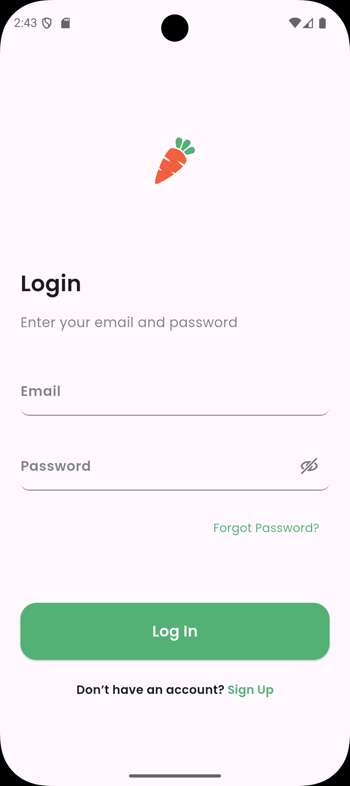
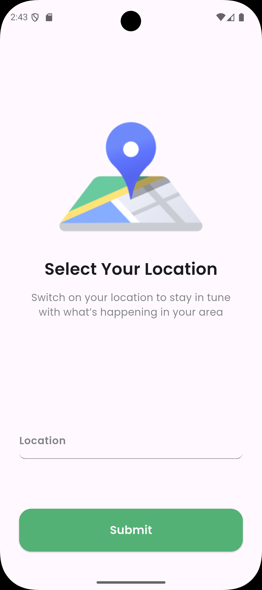
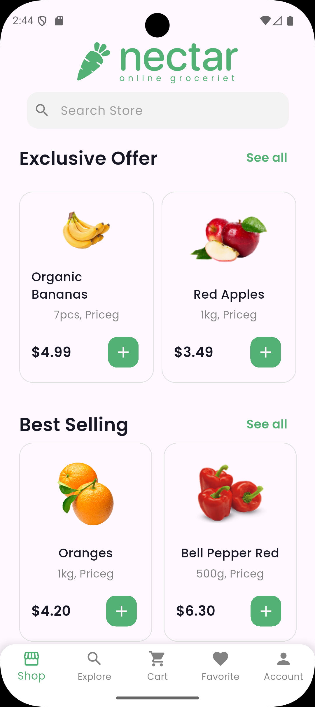
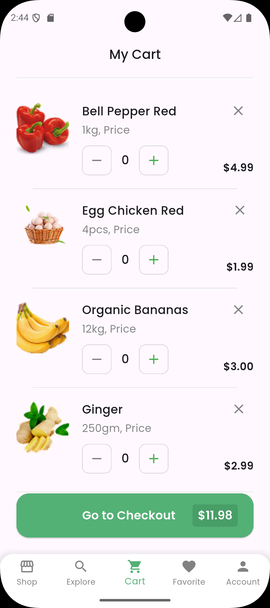
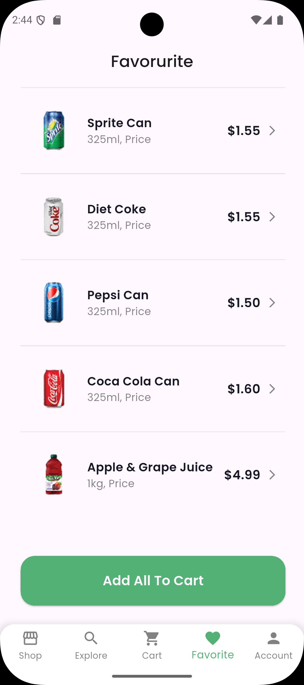
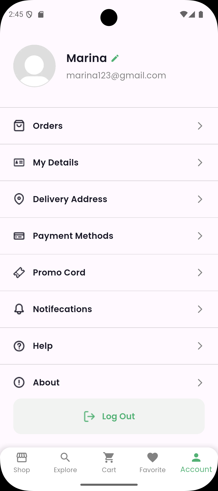

# 🍏 Nectar App

A modern grocery e-commerce Flutter application with a clean and intuitive UI.  
The app includes onboarding, authentication, and user-friendly forms to make shopping seamless.  

## ✨ Features

- **Splash Screen** – Displays a branded SVG splash before navigating to login.
- **Authentication** – Login page with email and password fields, and navigation to sign up.
- **Select Address** – Allows users to enter or choose their location.
- **Home Screen** – Displays featured products, categories, and offers.
- **Cart Screen** – Lists selected items with quantity adjustment and checkout.
- **Favorite Screen** – Shows products saved by the user for quick access.
- **Profile Screen** – User profile info, settings, and logout.
- **Custom Components** – Reusable widgets like `CustomButton` and `CustomTextFormField` for consistent styling.

## 📱 Screens

1. **Splash Screen**  
   Shows the app logo and automatically navigates to the login page.

2. **Login Page**  
   - Email & password fields  
   - Validation-ready design  
   - "Sign Up" link with tappable navigation

3. **Select Address Page**  
   - Location illustration (SVG)  
   - Address input  
   - Submit button

4. **Home Screen**  
   - Product list with images, names, prices  
   - Categories and promotional banners

5. **Cart Screen**  
   - Item list with quantity controls  
   - Checkout button

6. **Favorite Screen**  
   - Displays saved products

7. **Profile Screen**  
   - Shows user information and app settings

## 📱 Nectar App GIF

## 📱 Screenshots

| Splash Screen | Login Page | Select Address | SignUp Page | Home Screen | Cart Screen | Favorite Screen | Profile Screen |
|---------------|-----------|----------------|-------------|-------------|-------------|-----------------|----------------|
|  |  |  |  |  |  |  |

## 🛠 Tech Stack

- **Flutter** – Cross-platform UI toolkit
- **Dart** – Programming language
- **flutter_svg** – For rendering SVG assets

## 📂 Project Structure

## 🔗 Repository
Find the full code on [GitHub](https://github.com/iMarinaAdel/Nectar_App)

```
lib/
+---componant
|   +---Buttons
|   +---inputs
|   \---searchBar
+---const
+---core
|   \---utils
+---extentions
\---features
    +---account
    |   +---models
    |   +---pages
    |   \---widgets
    +---auth
    |   +---pages
    |   \---widgets
    +---cart
    |   +---models
    |   +---pages
    |   \---widget
    +---explore
    |   +---models
    |   +---pages
    |   \---widgets
    +---favorite
    |   +---models
    |   +---pages
    |   \---widgets
    +---home
    |   +---models
    |   +---pages
    |   \---widgets
    +---main
    +---order_accepdet
    |   \---pages
    +---product_detail
    |   +---pages
    |   \---widgets
    +---splash_screen
    \---welcome


